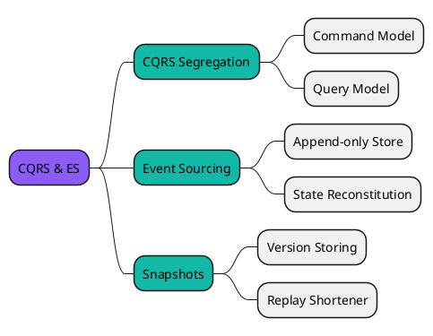

# CQRS & Event Sourcing Architecture

Write and Read Model segregation, Command handlers, Event serialization, and Event store reconstitution.

```plantuml
@startmindmap
*[#8b5cf6] CQRS & ES
**[#14b8a6] CQRS Segregation
*** Command Model
*** Query Model
**[#14b8a6] Event Sourcing
*** Append-only Store
*** State Reconstitution
**[#14b8a6] Snapshots
*** Version Storing
*** Replay Shortener
@endmindmap
```
