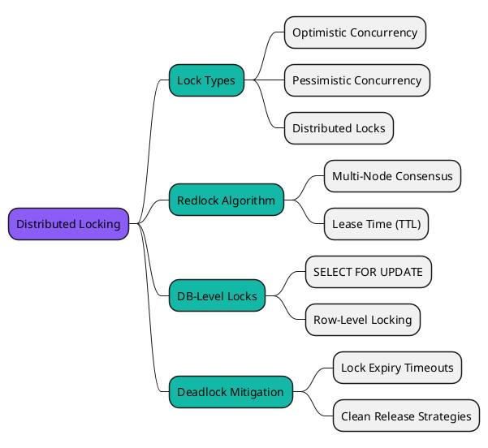

# Distributed Locking & Concurrency Control

Preventing race conditions and ensuring synchronization across scaled container instances using distributed locks (Redis Redlock, database locks).

```plantuml
@startmindmap
*[#8b5cf6] Distributed Locking
**[#14b8a6] Lock Types
*** Optimistic Concurrency
*** Pessimistic Concurrency
*** Distributed Locks
**[#14b8a6] Redlock Algorithm
*** Multi-Node Consensus
*** Lease Time (TTL)
**[#14b8a6] DB-Level Locks
*** SELECT FOR UPDATE
*** Row-Level Locking
**[#14b8a6] Deadlock Mitigation
*** Lock Expiry Timeouts
*** Clean Release Strategies
@endmindmap
```
