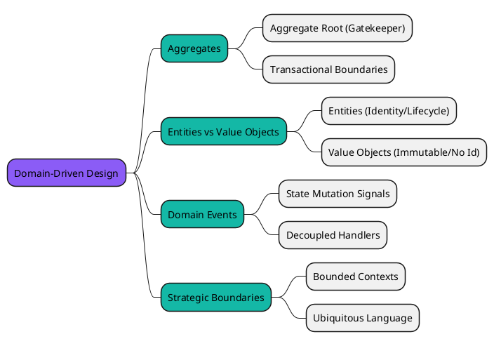

# Domain-Driven Design (DDD) Aggregates & Boundaries

Structuring complex domain models using aggregates, entities, value objects, domain events, and bounded contexts.

```plantuml
@startmindmap
*[#8b5cf6] Domain-Driven Design
**[#14b8a6] Aggregates
*** Aggregate Root (Gatekeeper)
*** Transactional Boundaries
**[#14b8a6] Entities vs Value Objects
*** Entities (Identity/Lifecycle)
*** Value Objects (Immutable/No Id)
**[#14b8a6] Domain Events
*** State Mutation Signals
*** Decoupled Handlers
**[#14b8a6] Strategic Boundaries
*** Bounded Contexts
*** Ubiquitous Language
@endmindmap
```
