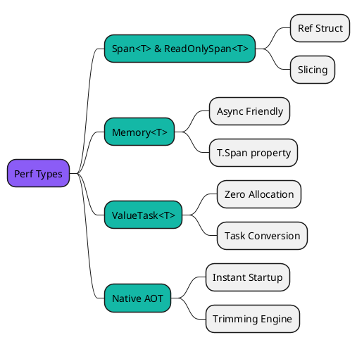

# High-Performance .NET Types

Zero-allocation strategies using Span, Memory, ValueTask, and Native AOT compilation.

```plantuml
@startmindmap
*[#8b5cf6] Perf Types
**[#14b8a6] Span<T> & ReadOnlySpan<T>
*** Ref Struct
*** Slicing
**[#14b8a6] Memory<T>
*** Async Friendly
*** T.Span property
**[#14b8a6] ValueTask<T>
*** Zero Allocation
*** Task Conversion
**[#14b8a6] Native AOT
*** Instant Startup
*** Trimming Engine
@endmindmap
```
