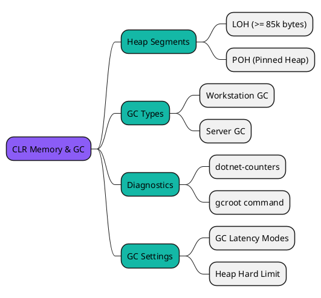

# Advanced Memory & Garbage Collection

CLR Heap segments, GC types (Workstation vs Server), diagnostic workflows (dotnet-dump, gcroot), and low-latency configuration.

```plantuml
@startmindmap
*[#8b5cf6] CLR Memory & GC
**[#14b8a6] Heap Segments
*** LOH (>= 85k bytes)
*** POH (Pinned Heap)
**[#14b8a6] GC Types
*** Workstation GC
*** Server GC
**[#14b8a6] Diagnostics
*** dotnet-counters
*** gcroot command
**[#14b8a6] GC Settings
*** GC Latency Modes
*** Heap Hard Limit
@endmindmap
```
