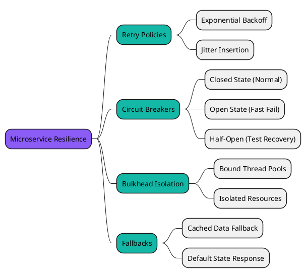

# Microservice Resilience & Polly Policies

How to build fault-tolerant distributed systems using retries, circuit breakers, fallbacks, and bulkhead isolation policies.

```plantuml
@startmindmap
*[#8b5cf6] Microservice Resilience
**[#14b8a6] Retry Policies
*** Exponential Backoff
*** Jitter Insertion
**[#14b8a6] Circuit Breakers
*** Closed State (Normal)
*** Open State (Fast Fail)
*** Half-Open (Test Recovery)
**[#14b8a6] Bulkhead Isolation
*** Bound Thread Pools
*** Isolated Resources
**[#14b8a6] Fallbacks
*** Cached Data Fallback
*** Default State Response
@endmindmap
```
