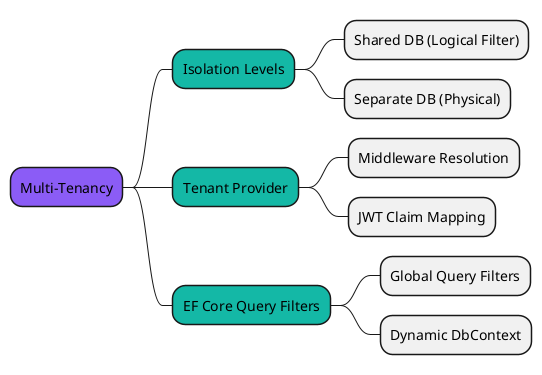

# Multi-Tenancy Isolation Architectures

Database isolation levels, dynamic connection strings, scoped ITenantProvider resolution, and EF Core query filtering.

```plantuml
@startmindmap
*[#8b5cf6] Multi-Tenancy
**[#14b8a6] Isolation Levels
*** Shared DB (Logical Filter)
*** Separate DB (Physical)
**[#14b8a6] Tenant Provider
*** Middleware Resolution
*** JWT Claim Mapping
**[#14b8a6] EF Core Query Filters
*** Global Query Filters
*** Dynamic DbContext
@endmindmap
```
