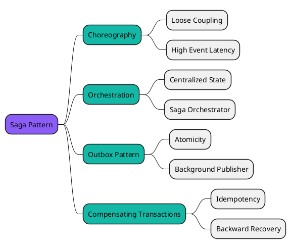

# Saga Pattern & Distributed Consistency

Coordinates multiple local transactions across services to achieve eventual consistency. Rollbacks are managed via compensating actions.

```plantuml
@startmindmap
*[#8b5cf6] Saga Pattern
**[#14b8a6] Choreography
*** Loose Coupling
*** High Event Latency
**[#14b8a6] Orchestration
*** Centralized State
*** Saga Orchestrator
**[#14b8a6] Outbox Pattern
*** Atomicity
*** Background Publisher
**[#14b8a6] Compensating Transactions
*** Idempotency
*** Backward Recovery
@endmindmap
```
