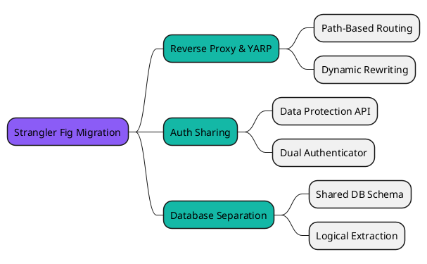

# Strangler Fig: Monolith to .NET 9 Migration

Migrate legacy MVC 4.8 sites incrementally to modern .NET 9 using YARP, Shared Data Protection Keys, and logical database schema extractions.

```plantuml
@startmindmap
*[#8b5cf6] Strangler Fig Migration
**[#14b8a6] Reverse Proxy & YARP
*** Path-Based Routing
*** Dynamic Rewriting
**[#14b8a6] Auth Sharing
*** Data Protection API
*** Dual Authenticator
**[#14b8a6] Database Separation
*** Shared DB Schema
*** Logical Extraction
@endmindmap
```
