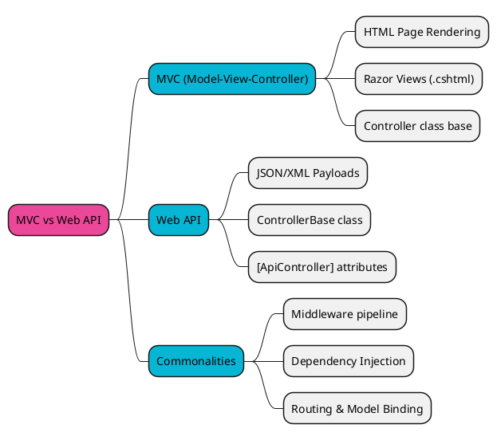

# ASP.NET Core MVC vs Web API

Comparing MVC controllers (HTML rendering) and Web API controllers (JSON/data endpoint serialization) in ASP.NET Core.

```plantuml
@startmindmap
*[#ec4899] MVC vs Web API
**[#06b6d4] MVC (Model-View-Controller)
*** HTML Page Rendering
*** Razor Views (.cshtml)
*** Controller class base
**[#06b6d4] Web API
*** JSON/XML Payloads
*** ControllerBase class
*** [ApiController] attributes
**[#06b6d4] Commonalities
*** Middleware pipeline
*** Dependency Injection
*** Routing & Model Binding
@endmindmap
```
