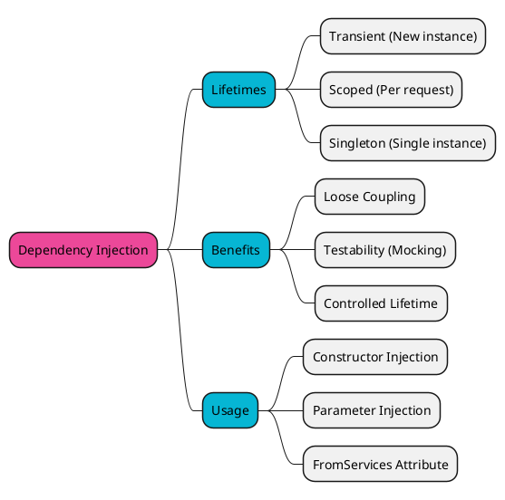

# Dependency Injection Basics

Understanding the basics of Dependency Injection, inversion of control, and service lifetimes in ASP.NET Core.

```plantuml
@startmindmap
*[#ec4899] Dependency Injection
**[#06b6d4] Lifetimes
*** Transient (New instance)
*** Scoped (Per request)
*** Singleton (Single instance)
**[#06b6d4] Benefits
*** Loose Coupling
*** Testability (Mocking)
*** Controlled Lifetime
**[#06b6d4] Usage
*** Constructor Injection
*** Parameter Injection
*** FromServices Attribute
@endmindmap
```
