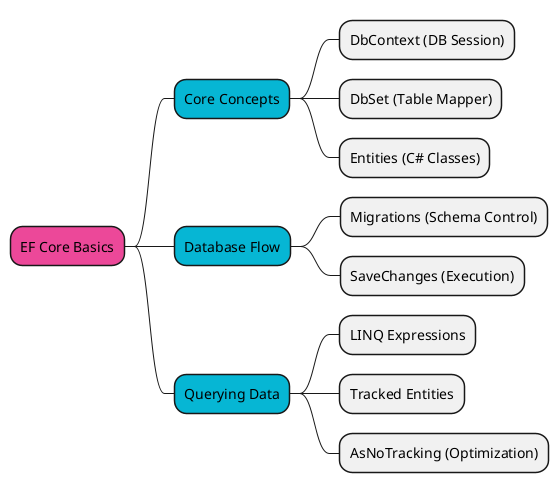

# Entity Framework Core Basics

Basic components of EF Core: DbContext, DbSets, entities, migrations, and basic CRUD operations.

```plantuml
@startmindmap
*[#ec4899] EF Core Basics
**[#06b6d4] Core Concepts
*** DbContext (DB Session)
*** DbSet (Table Mapper)
*** Entities (C# Classes)
**[#06b6d4] Database Flow
*** Migrations (Schema Control)
*** SaveChanges (Execution)
**[#06b6d4] Querying Data
*** LINQ Expressions
*** Tracked Entities
*** AsNoTracking (Optimization)
@endmindmap
```
