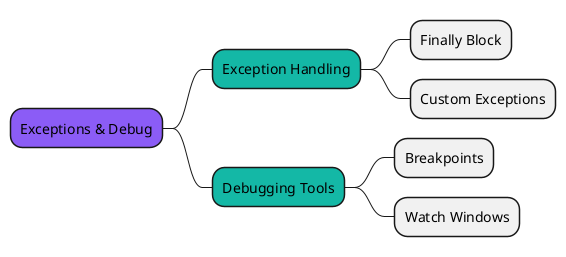

# Exception Handling & Debugging

Try-Catch structures, stack traces, custom exception classes, and visual studio debugging tools.

```plantuml
@startmindmap
*[#8b5cf6] Exceptions & Debug
**[#14b8a6] Exception Handling
*** Finally Block
*** Custom Exceptions
**[#14b8a6] Debugging Tools
*** Breakpoints
*** Watch Windows
@endmindmap
```
