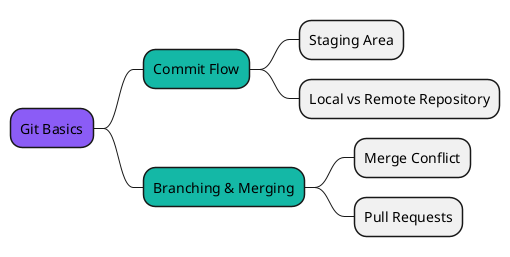

# Git Version Control

Stage, commit, branching, merging, conflict resolution, and remote operations.

```plantuml
@startmindmap
*[#8b5cf6] Git Basics
**[#14b8a6] Commit Flow
*** Staging Area
*** Local vs Remote Repository
**[#14b8a6] Branching & Merging
*** Merge Conflict
*** Pull Requests
@endmindmap
```
