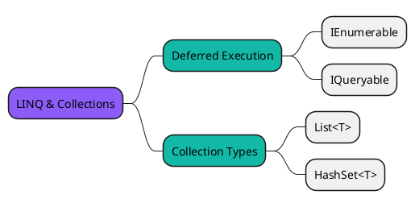

# LINQ & Collections Framework

Deferred execution, IQueryable vs IEnumerable, list types, and performance considerations.

```plantuml
@startmindmap
*[#8b5cf6] LINQ & Collections
**[#14b8a6] Deferred Execution
*** IEnumerable
*** IQueryable
**[#14b8a6] Collection Types
*** List<T>
*** HashSet<T>
@endmindmap
```
