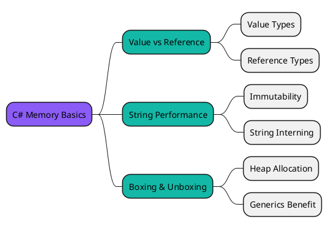

# C# Memory & Types

Fundamentals of Value vs Reference types, Stack and Heap allocation rules, and string optimizations.

```plantuml
@startmindmap
*[#8b5cf6] C# Memory Basics
**[#14b8a6] Value vs Reference
*** Value Types
*** Reference Types
**[#14b8a6] String Performance
*** Immutability
*** String Interning
**[#14b8a6] Boxing & Unboxing
*** Heap Allocation
*** Generics Benefit
@endmindmap
```
