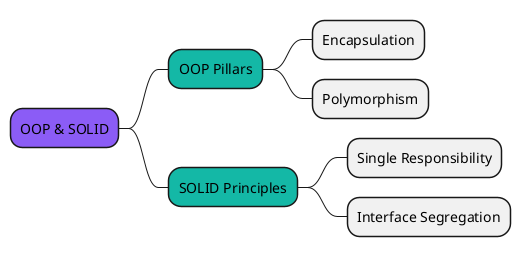

# OOP Pillars & SOLID Principles

Core Object-Oriented design, abstract layers, interfaces, and clean SOLID principles.

```plantuml
@startmindmap
*[#8b5cf6] OOP & SOLID
**[#14b8a6] OOP Pillars
*** Encapsulation
*** Polymorphism
**[#14b8a6] SOLID Principles
*** Single Responsibility
*** Interface Segregation
@endmindmap
```
