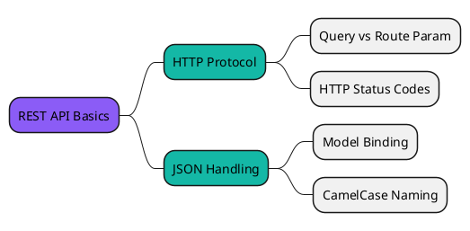

# REST API Core Concepts

HTTP protocols, status codes, controller routing, and JSON serialization defaults.

```plantuml
@startmindmap
*[#8b5cf6] REST API Basics
**[#14b8a6] HTTP Protocol
*** Query vs Route Param
*** HTTP Status Codes
**[#14b8a6] JSON Handling
*** Model Binding
*** CamelCase Naming
@endmindmap
```
