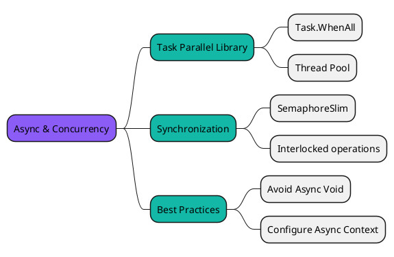

# Asynchronous Programming & Concurrency

Multithreading concepts, task execution strategies, thread-safe collections, and synchronization mechanisms.

```plantuml
@startmindmap
*[#8b5cf6] Async & Concurrency
**[#14b8a6] Task Parallel Library
*** Task.WhenAll
*** Thread Pool
**[#14b8a6] Synchronization
*** SemaphoreSlim
*** Interlocked operations
**[#14b8a6] Best Practices
*** Avoid Async Void
*** Configure Async Context
@endmindmap
```
