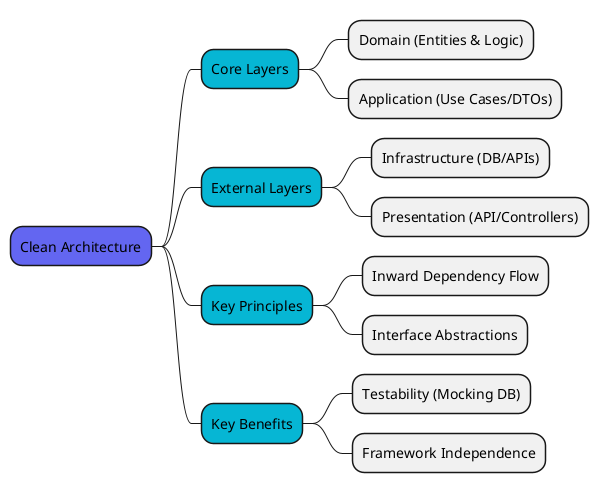

# Clean Architecture & Decoupled Layers

Structuring applications to separate business rules from external technologies and frameworks.

```plantuml
@startmindmap
*[#6366f1] Clean Architecture
**[#06b6d4] Core Layers
*** Domain (Entities & Logic)
*** Application (Use Cases/DTOs)
**[#06b6d4] External Layers
*** Infrastructure (DB/APIs)
*** Presentation (API/Controllers)
**[#06b6d4] Key Principles
*** Inward Dependency Flow
*** Interface Abstractions
**[#06b6d4] Key Benefits
*** Testability (Mocking DB)
*** Framework Independence
@endmindmap
```
