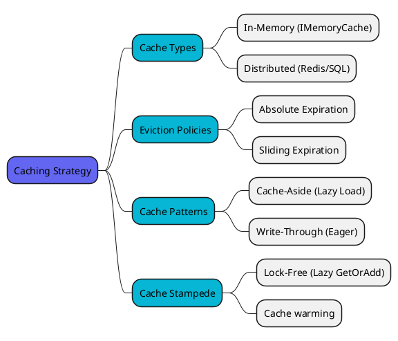

# In-Memory & Distributed Caching Strategy

Improving application response times and database load using caching strategies (IMemoryCache, Redis).

```plantuml
@startmindmap
*[#6366f1] Caching Strategy
**[#06b6d4] Cache Types
*** In-Memory (IMemoryCache)
*** Distributed (Redis/SQL)
**[#06b6d4] Eviction Policies
*** Absolute Expiration
*** Sliding Expiration
**[#06b6d4] Cache Patterns
*** Cache-Aside (Lazy Load)
*** Write-Through (Eager)
**[#06b6d4] Cache Stampede
*** Lock-Free (Lazy GetOrAdd)
*** Cache warming
@endmindmap
```
