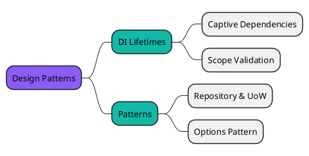

# C# Design Patterns & Dependency Injection

SOLID design patterns, IoC containers, dynamic decorators, and object lifetime management.

```plantuml
@startmindmap
*[#8b5cf6] Design Patterns
**[#14b8a6] DI Lifetimes
*** Captive Dependencies
*** Scope Validation
**[#14b8a6] Patterns
*** Repository & UoW
*** Options Pattern
@endmindmap
```
