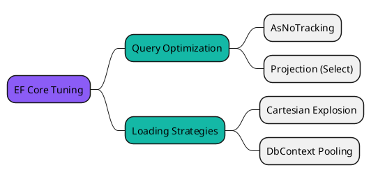

# EF Core Query & Performance Tuning

Object-Relational Mapping optimizations, query compiling, database connection pooling, and tracking states.

```plantuml
@startmindmap
*[#8b5cf6] EF Core Tuning
**[#14b8a6] Query Optimization
*** AsNoTracking
*** Projection (Select)
**[#14b8a6] Loading Strategies
*** Cartesian Explosion
*** DbContext Pooling
@endmindmap
```
