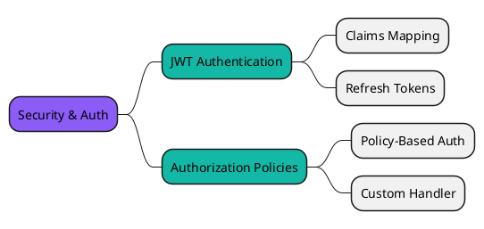

# Security, Authentication & Authorization

JWT security tokens, custom policy validation, and secure cryptographic storage.

```plantuml
@startmindmap
*[#8b5cf6] Security & Auth
**[#14b8a6] JWT Authentication
*** Claims Mapping
*** Refresh Tokens
**[#14b8a6] Authorization Policies
*** Policy-Based Auth
*** Custom Handler
@endmindmap
```
