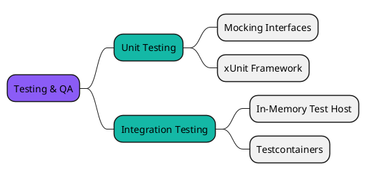

# Testing Frameworks & Methodologies

Unit, integration, and performance benchmarking methodologies for C# services.

```plantuml
@startmindmap
*[#8b5cf6] Testing & QA
**[#14b8a6] Unit Testing
*** Mocking Interfaces
*** xUnit Framework
**[#14b8a6] Integration Testing
*** In-Memory Test Host
*** Testcontainers
@endmindmap
```
