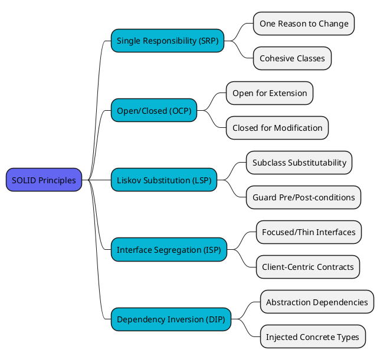

# SOLID Principles in C# Design

Core object-oriented design principles to write clean, maintainable, and testable code in C# applications.

```plantuml
@startmindmap
*[#6366f1] SOLID Principles
**[#06b6d4] Single Responsibility (SRP)
*** One Reason to Change
*** Cohesive Classes
**[#06b6d4] Open/Closed (OCP)
*** Open for Extension
*** Closed for Modification
**[#06b6d4] Liskov Substitution (LSP)
*** Subclass Substitutability
*** Guard Pre/Post-conditions
**[#06b6d4] Interface Segregation (ISP)
*** Focused/Thin Interfaces
*** Client-Centric Contracts
**[#06b6d4] Dependency Inversion (DIP)
*** Abstraction Dependencies
*** Injected Concrete Types
@endmindmap
```
