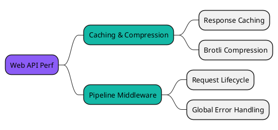

# Web API Performance & Middleware

Caching, rate limiting, payload compression, and request-response pipeline optimizations.

```plantuml
@startmindmap
*[#8b5cf6] Web API Perf
**[#14b8a6] Caching & Compression
*** Response Caching
*** Brotli Compression
**[#14b8a6] Pipeline Middleware
*** Request Lifecycle
*** Global Error Handling
@endmindmap
```
